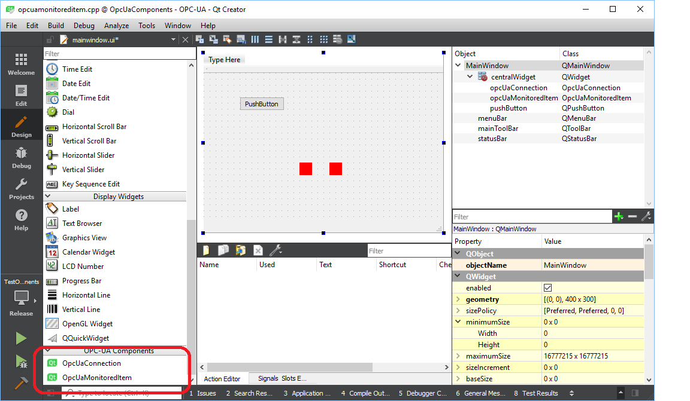
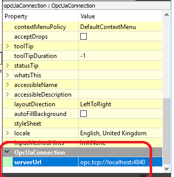
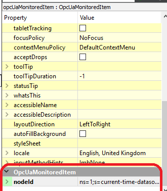
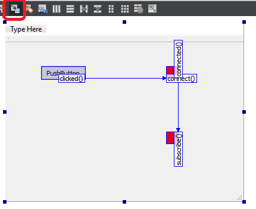

# QtOpcUaComponents

Experimental Qt Designer components for quick OPC-UA client prototyping. The
basic idea was inspired by the
[caQtDM](http://epics.web.psi.ch/software/caqtdm/) project for the EPICS
framework, only this one here is much less amibitious.

## Building

### Prerequisite Open62541
This library depends on the open source [open62541](https://open62541.org/)
library. For the components build it with shared libraries enabled:

```
cmake -G<your generator> -DCMAKE_INSTALL_PREFIX=<some install directory> -DBUILD_SHARED_LIBS=ON <source directory>
```

For a Ninja build including the examples

```
cmake -G"Ninja" -DCMAKE_INSTALL_PREFIX=c:\src\open62541\install-msvc2017 -DUA_BUILD_EXAMPLES=ON -DCMAKE_CXX_COMPILER=cl.exe -DBUILD_SHARED_LIBS=ON <source directory>
```

Make sure to use an install prefix and run the install target after building.
For the components we will need the headers and the library generated that way.

```
cmake --build .
cmake --build . --target install
```

### Building the components

To build the QtOpcUaComponents you first have to set an environment variable
pointing to the install path of the open62541 library.

```
set OPEN62541_INSTALL_PATH=<install path specified above>
```

or

```
export OPEN62541_INSTALL_PATH=<install path specified above>
```

For the component to become visible and usable in the Qt Designer you have to
build the component with the compiler and the Qt version of your Qt Creator
installation. Check 'Help' -> 'About Creator' to find out which version and
compiler you need.

Now you can build and install the components using qmake

```
qmake
make
make install
```

or
```
qmake
nmake
nmake install
```

However to be able to use the component from the Qt Creator/Designer there is
still one manual step to do. You have to copy the `OpcUaComponents.so` or
`OpcUaComponents.dll` file from

`Qt/<Qt version>/<toolchain>/plugins/desginer`

to

`Qt/Tools/QtCreator/bin/plugins/designer`

## Using

Now you can use the components in your own 'Qt Widgets Application'. When you
open the form designer you should see the new components in the category
'OPC-UA Components':



When you place such a component on a form, they will be shown as a red
rectangle. Once you compile the application these rectangles are no longer
visible.

For both components you can set respective property values such as a server URL
or node ids just like any other Qt component properties.




Now you can connect the signals and slots in the 'Signal/Slot Editor' as follows:



Finally to actually build and properly use your new application there are again
a few manual steps (Any help to reduce these manual steps are greatly welcomed
;-) ).

* We need to add the linker details to the OpcUaComponents library. Add the
  following line to your projects `.pro` File:

```
LIBS += -L$$[QT_INSTALL_PLUGINS]/designer -lOpcUaComponents
```

* The monitored item needs to be hooked up to the connection. Assuming you
  placed a connection called `opcUaConnection` and a monitored item called
  `opcUaMonitoredItem`, you now add the following line to the constructor of
  the `MainWindow`:

```
    ui->opcUaMonitoredItem->setConnection(ui->opcUaConnection);

```

* Your application has two runtime dependencies that must be available to the
  built executable. For a MSVC build you could copy the `OpcUaComponents.dll`
  and the `open62541.dll` to the directory where your application was built to.
  For a Linux build something similar could be achieved through setting the
  `LD_LIBRARY_PATH`.

## Additional Hints

* If you build the open62541 library with the option `UA_BUILD_EXAMPLES=ON` you
  will also get a series of simple OPC-UA servers that you can use to test your
  clients. For example the `tutorial_server_datasource` provides a timestamp
  under the node id `ns=1,s=current-time-datasource` that is updated in regular
  intervals.
* Make sure you use the components and libraries in the matching modes
  (Release/Debug) or otherwise the application will crash.
